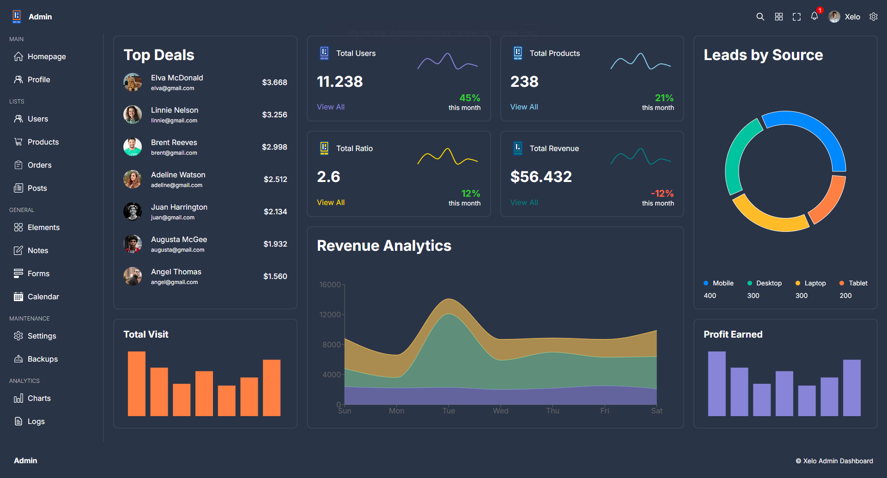
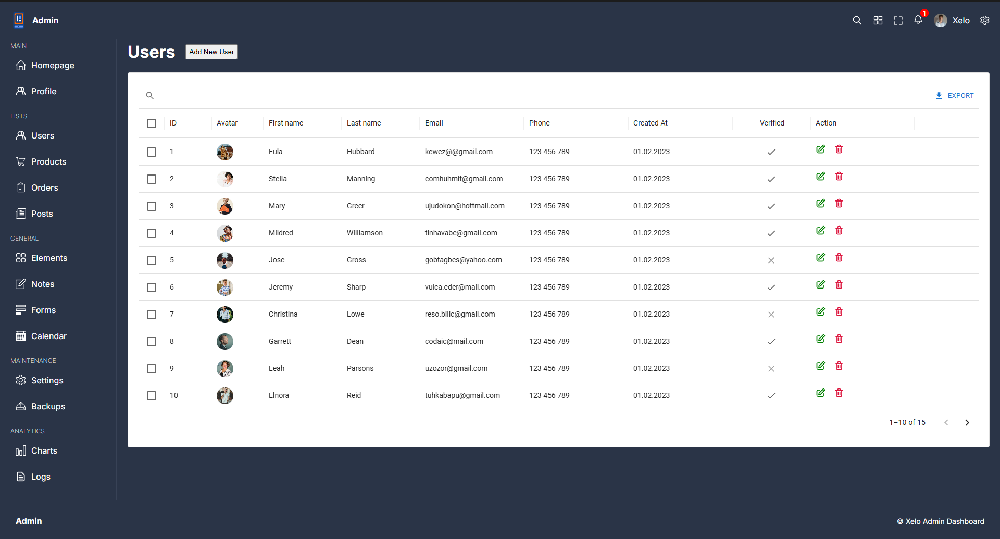
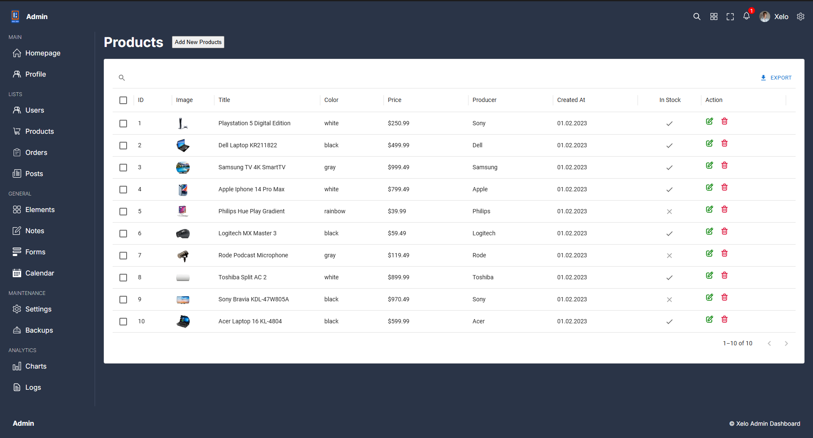

# Admin Dashboard

The **Admin Dashboard** project is a modern web application for managing users, products, and analytics. It demonstrates the use of **React**, **TypeScript**, **Vite**, and advanced UI libraries to create a responsive and interactive admin interface.

---

## 📖 Table of Contents

- [🚀 Features](#-features)
- [📂 Project Structure](#-project-structure)
- [🛠️ Technologies Used](#️-technologies-used)
- [🌟 Key Functionalities](#-key-functionalities)
- [📸 Screenshots](#-screenshots)
- [⚙️ Installation and Usage](#️-installation-and-usage)
- [🤝 Contributing](#-contributing)
- [📜 License](#-license)

---

## 🚀 Features

- **User & Product Management**: View, add, and manage users and products in interactive tables.
- **Routing**: Multi-page navigation with [React Router](https://reactrouter.com/).
- **Data Visualization**: Rich charts and analytics using [Recharts](https://recharts.org/).
- **Material UI Data Grid**: Powerful tables with filtering, sorting, and actions via [MUI X Data Grid](https://mui.com/x/react-data-grid/).
- **Responsive Design**: Optimized for both desktop and mobile devices.
- **Modular Components**: Clean, reusable component structure.

---

## 📂 Project Structure

```bash
Admin-Dashboard/
├── .gitignore
├── index.html
├── package.json
├── README.md
├── tsconfig.json
├── vite.config.ts
├── public/
│   ├── *.svg
│   ├── *.png
│   └── screenshots/
└── src/
    ├── App.tsx
    ├── main.tsx
    ├── data.ts
    ├── styles/
    ├── components/
    └── pages/
```

---

## 🛠️ Technologies Used

- **React**: UI library for building interactive interfaces.
- **TypeScript**: Type-safe JavaScript.
- **Vite**: Fast build tool and dev server.
- **React Router**: For client-side routing.
- **Recharts**: For data visualization and charts.
- **MUI X Data Grid**: For advanced tables and data management.
- **Sass (SCSS)**: For modular and maintainable styling.

---

## 🌟 Key Functionalities

1. **User & Product Tables**

   - Interactive tables with sorting, filtering, and actions (view, delete).
   - Add new users/products via modal forms.

2. **Analytics Dashboard**

   - Visualize data with line, bar, area, and pie charts.
   - See top users, product stats, and revenue analytics.

3. **Routing**

   - Navigate between dashboard, users, products, and detail pages.

4. **Responsive Layout**
   - Works seamlessly on desktop and mobile devices.

---

## 📸 Screenshots

### Home Page



### Users Details


### Users Table



### Products Table



---

## ⚙️ Installation and Usage

1. Clone the repository:
   ```bash
   git clone https://github.com/your-username/Admin-Dashboard
   cd Admin-Dashboard
   ```
2. Install dependencies:
   ```bash
   npm install
   ```
3. Start the development server:
   ```bash
   npm run dev
   ```
4. Open the app in your browser at http://localhost:5173.

---

## 🤝 Contributing

Contributions are welcome! If you have suggestions or improvements, feel free to fork the repository and submit a pull request.

---

## 📜 License

This project is under the MIT License - see the [LICENSE](./LICENSE) file for details.
